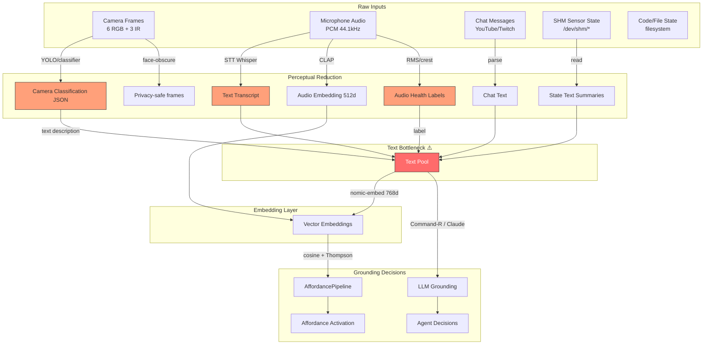

# Grounding Inventory Audit

## Grounding Sites Catalog

### LLM Invocation Sites (Command-R / Claude / Gemini)

| File | Function/Class | Input Modality | Output Modality | Info Loss |
|------|---------------|----------------|-----------------|-----------|
| `agents/hapax_daimonion/pipeline_start.py` | Voice pipeline agent | text (transcript) | text (response) | Full audio context lost at STT boundary |
| `agents/content_programmer/grounding_runner.py` | Grounding runner | text (programme context) | text (grounding decision) | Visual/audio evidence reduced to text summaries |
| `agents/audio_grounding/__main__.py` | Audio grounding | text (audio description) | text (grounded label) | Spectral/temporal detail lost at description |
| `agents/audience_perception.py` | Audience perception | text (chat messages) | text (perception summary) | Non-verbal chat signals lost |
| `agents/activity_analyzer.py` | Activity analyzer | text (system state) | text (activity label) | Temporal patterns flattened |
| `agents/briefing.py` | Briefing agent | text (state summaries) | text (briefing) | Cross-modal correlation lost |
| `agents/profiler.py` | Profiler agent | text (observations) | text (profile update) | Observation context lost |
| `agents/deliberative_council/` | Council agents | text (proposals) | text (decisions) | Deliberation history compressed |
| `agents/demo_pipeline/research.py` | Demo pipeline | text (research context) | text (demo script) | Research depth reduced |
| `agents/chat_monitor/structural_analyzer.py` | Chat analyzer | text (messages) | text (structure) | Paralinguistic cues lost |

### Embedding Sites

| File | Function/Class | Input Modality | Output Modality | Info Loss |
|------|---------------|----------------|-----------------|-----------|
| `agents/_affordance_pipeline.py` | AffordancePipeline.embed | text (impingement) | vector (768d) | Semantic reduction to fixed dimensions |
| `agents/_apperception.py` | Apperception embed | text (concern) | vector (768d) | Temporal/relational context flattened |
| `agents/content_candidate_discovery/runner.py` | Content discovery | text (candidate) | vector (768d) | Multi-modal candidate reduced to text embed |
| `agents/audio_processor.py` | Audio embed | text (audio description) | vector (768d) | All acoustic detail lost at text description |
| `shared/qdrant_schema.py` | 11 Qdrant collections | text → vector | vector storage | Per-collection semantic compression |
| `agents/ingest.py` | RAG ingestion | text (documents) | vector (768d) | Document structure/layout lost |

### AffordancePipeline Match Sites

| File | Function/Class | Input Modality | Output Modality | Info Loss |
|------|---------------|----------------|-----------------|-----------|
| `agents/_affordance_pipeline.py` | AffordancePipeline.activate | vector + context | affordance activation | Thompson sampling adds noise for exploration |
| `agents/audio_router/policy.py` | Audio routing | text (state) | routing decision | Audio signal reduced to state label |
| `agents/auto_clip/segment_detection.py` | Clip detection | text (segment) | clip boundary | Perceptual salience reduced to text match |
| `agents/code_narration/producer.py` | Code narration | text (code context) | narration text | Code structure reduced to description |

### Perceptual Field Read Sites

| File | Function/Class | Input Modality | Output Modality | Info Loss |
|------|---------------|----------------|-----------------|-----------|
| `agents/audio_perception/daemon.py` | Audio perception | audio (PCM) | text (classification) | **Primary bottleneck:** full audio → text label |
| `agents/_apperception_shm.py` | SHM perception | binary (shm) | text (state) | Binary sensor data → text summary |
| `agents/audio_health/classifier.py` | Audio classifier | audio (metrics) | text (health label) | Spectral detail → categorical label |
| `agents/studio_compositor/camera_classifier_publisher.py` | Camera classifier | video (frames) | text (classification JSON) | **Primary bottleneck:** full video → text JSON |
| `agents/studio_compositor/follow_mode.py` | Follow mode | JSON (detections) | text (recommendation) | Spatial/temporal detail → role label |
| `agents/_clap.py` | CLAP audio | audio (waveform) | vector (512d) | Audio → fixed embedding |
| `agents/visual_layer_aggregator/` | Visual aggregator | multi-sensor | text (stimmung) | **Primary bottleneck:** multi-sensor fusion → text |

## Grounding Flow Diagram

## Text-Reduction Bottlenecks by Input Modality

| Input Modality | Bottleneck Location | What Is Lost |
|---------------|---------------------|-------------|
| **Video/Camera** | Camera classifier → JSON labels | Spatial composition, lighting, gesture, movement dynamics |
| **Audio** | Whisper STT → text transcript | Prosody, timbre, rhythm, silence patterns, environmental sound |
| **Audio (health)** | RMS/crest → categorical label | Spectral detail, transient character, frequency content |
| **Multi-sensor** | Visual layer aggregator → stimmung text | Cross-modal temporal correlation, sensor agreement patterns |
| **Chat** | Minimal loss (already text) | Emoji semantics, timing patterns, message clustering |

## Key Finding

The dominant information loss pattern is **non-text → text description → embedding**. Every non-text modality passes through a text serialization step before reaching the embedding layer or LLM. The CLAP audio embedding (`agents/_clap.py`) is the only path that preserves non-text signal directly into vector space, but it is not yet wired into the AffordancePipeline.
