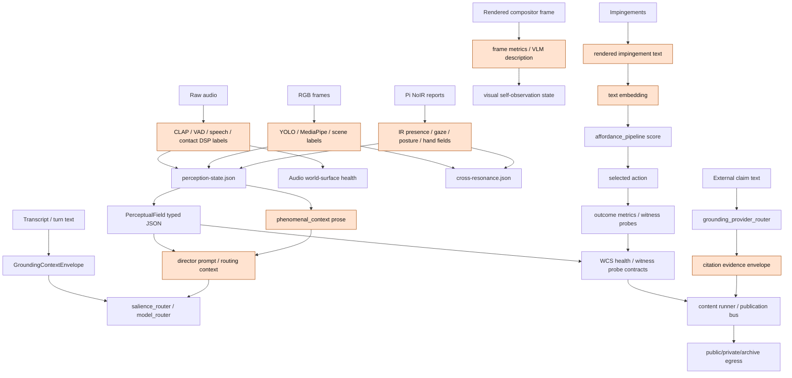

# Multimodal Grounding Problem Map

This is a Phase 1 problem-space map. It is not an implementation plan, not a
model deployment proposal, and not a claim that multimodal grounding must be
built. The purpose is to determine whether the problem exists in Hapax, where
the bottlenecks are, which hypotheses are falsifiable, and which gaps can be
tested with the hardware already named for the request: Hailo NPU, IR cameras,
and audio.

## Executive Finding

Hapax already has many grounding mechanisms, but most are local, typed, and
downstream-facing rather than cross-modal, claim-level, and replayable. Audio,
IR, RGB vision, contact-mic, screen, tool, archive, publication, and WCS
surfaces all produce evidence-like signals. The common pattern is:

1. A rich modality is reduced to labels, scalar probabilities, short JSON, or a
   natural-language prompt block.
2. That reduced representation is consumed by routing, affordance selection,
   content programming, publication, or conversation.
3. The original modality, confidence structure, temporal window, and
   contradiction surface are usually unavailable to the later claim.

The problem is therefore real enough to justify evaluation. The current
evidence does not justify a multimodal coordinator or shared embedding space.
The immediate research question is whether current filesystem-bus signals can
support falsifiable agreement, disagreement, staleness, and claim-authority
tests before any new coordination layer is introduced.

## Literature Map

### Symbol Grounding

Harnad's symbol grounding problem asks how tokens can acquire meaning beyond
relations to other tokens. For Hapax, this is the difference between a statement
being well-formed in text and being anchored to a perceptual, action, or witness
surface. Bender and Koller sharpen the same risk for language-only systems:
form alone is not sufficient for meaning when there is no connection to
communicative intent or world state.

Implication for Hapax: current text-reduction paths can be useful, but a text
prompt block cannot by itself certify perceptual claims such as "the operator is
at the desk", "the broadcast audio is live", or "the compositor frame shows the
claimed visual state".

### Embodied AI

Embodied AI frames grounding as perception-action coupling in an environment,
not just multimodal classification. The survey literature emphasizes agents
that perceive, act, and receive feedback in simulation or physical settings.
Bisk et al. argue that language understanding is grounded by experience across
vision, interaction, social context, and goals.

Implication for Hapax: the relevant evidence is not merely whether a modality
has a label. It is whether the label changes action selection, whether action
outcomes re-enter the evidence stream, and whether stale or contradictory
signals are prevented from authorizing claims.

### Enactivism And Sensorimotor Accounts

Varela, Thompson, and Rosch argue that cognition is enacted through embodied
activity. O'Regan and Noe's sensorimotor account treats perception as tied to
mastery of sensorimotor contingencies rather than passive image recovery.

Implication for Hapax: a grounded system should not only describe sensor state.
It should be able to expose how a perception changes under action or time. A
single JSON snapshot is therefore a weak grounding artifact unless it carries
freshness, provenance, and an outcome or counterfactual test path.

### Perceptual Control Theory

Powers' Perceptual Control Theory models behavior as control of perception, not
direct output production. Hapax already uses this vocabulary in SCM and control
health docs.

Implication for Hapax: a grounding signal is stronger when it participates in a
closed loop: reference, perception, error, action, and observed effect. A label
that never affects control, or an action whose outcome is not witnessed, is weak
grounding even if the classifier is accurate.

### Affordance Theory

Gibson's affordance theory treats perception in relation to action
possibilities offered by an environment. In software terms, a perceptual signal
is not only a state description; it constrains what actions are currently
available, safe, or meaningful.

Implication for Hapax: the existing affordance pipeline is a plausible place to
observe grounded action selection, but today its strongest inputs are rendered
text and embeddings. The open question is whether perceptual evidence can reach
affordance recruitment without being flattened into text too early.

## Current Grounding Inventory

This inventory groups the codebase surfaces where "grounding" is already
implemented or implied. "Information loss" names the point where a modality,
witness, or temporal structure is reduced before later consumers can reason
over it.

### Perception And Modality Grounding

| Surface | Input modality | Output | Information loss |
|---|---|---|---|
| `agents/audio_grounding/__main__.py` | PipeWire audio window from `hapax-broadcast-normalized` | CLAP scene labels and probabilities in `/dev/shm/hapax-audio-grounding/state.json` | Waveform, source separation, speaker identity, musical structure, prosody, and temporal dynamics collapse to coarse label probabilities. |
| `agents/world_surface/audio_adapter.py`, `shared/audio_world_surface_*` | Audio health and marker evidence | Audio world-surface fixtures and health rows | Useful public-claim posture, but not full semantic audio grounding. |
| `agents/hapax_daimonion/backends/ambient_audio.py`, `speech_classifier.py`, `vad_state_publisher.py` | Ambient audio, speech, VAD | Conversation/activity behaviors | Speech and ambience become activity categories; raw acoustic evidence is not preserved at claim level. |
| `agents/hapax_daimonion/backends/contact_mic.py` | Desk/contact mic DSP | Desk activity metrics | Surface vibration becomes activity enum/energy metrics. |
| `agents/hapax_daimonion/backends/contact_mic_ir.py` | Contact mic plus IR hand zone | Fused desk activity | Cross-modal disambiguation exists, but as local rule refinement rather than replayable evidence graph. |
| `agents/hapax_daimonion/backends/ir_presence.py` | Pi NoIR edge reports | Presence, gaze zone, posture, hand activity, brightness, drowsiness, heart-rate fields | Per-camera frames and detection distributions are fused to enums, booleans, and scalars. |
| `agents/hapax_daimonion/backends/vision.py` | RGB frames plus audio/desk/IR context | Objects, gaze, hands, scenes, inferred activity | Object geometry, confidence structure, and temporal tracks collapse to activity labels; some fusion is hard-coded and should be treated as legacy/provisional research evidence. |
| `agents/hapax_daimonion/_perception_state_writer.py` | Backend behaviors across audio, visual, IR, contact, MIDI, mixer | `perception-state.json` | Multiple modalities are flattened into one latest-state JSON; consent curtailment correctly redacts, but also removes fields from later grounding. |
| `shared/perceptual_field.py` | Perception state, stimmung, album, chat, stream, presence, objectives | Typed `PerceptualField` for the director | Stronger than prose because fields remain structured, but still primarily latest-state aggregation with limited raw provenance. |
| `shared/perceptual_field_grounding_registry.py` | Claimable perceptual field keys | Grounding decisions with evidence class, temporal band, witness policy, authority ceiling | Promising claim contract; coverage is registry-bound and does not solve cross-modal contradiction by itself. |
| `agents/vision_observer/__main__.py` | Rendered frame snapshot | One-sentence vision-model description in `/dev/shm/hapax-vision` | Frame is reduced through a remote model description; raw pixels and alternative interpretations are not available to downstream claim gates. |
| `agents/visual_layer_aggregator/frame_perception.py` | Rendered frame pixels | Brightness, contrast, entropy, saturation metrics | Captures formal visual properties only; no semantic witness of what is visible. |
| `agents/visual_layer_aggregator/apperception_bridges.py` | Audio labels plus visual detections | `cross-resonance.json` | One of the few explicit cross-modal traces, but sparse and not yet validated as necessary. |

### Conversation, Routing, And Discursive Grounding

| Surface | Input modality | Output | Information loss |
|---|---|---|---|
| `agents/hapax_daimonion/phenomenal_context.py` | Temporal bands, stimmung, apperception JSON | Natural-language prompt orientation | Structured state becomes text; source confidence and disagreement are hard to recover. |
| `shared/grounding_context.py` | Turn text, source freshness, temporal bands, claim floor, tools | `GroundingContextEnvelope` plus clause checks | Enforces textual/temporal admissibility, but multimodal evidence enters only as rendered claims or witness IDs. |
| `agents/hapax_daimonion/grounding_ledger.py` | Conversation DUs and acceptance signals | DU grounding state, GQI, effort directives | Interaction grounding, not sensory grounding; acceptance is mostly inferred from text behavior. |
| `agents/hapax_daimonion/grounding_evaluator.py` | Response text and context | Langfuse grounding/reference scores | Post-hoc text evaluation; no direct multimodal claim verification. |
| `agents/hapax_daimonion/cpal/grounding_bridge.py` | Grounding ledger state | CPAL grounding signals | Preserves conversational control state, not raw perceptual evidence. |
| `agents/hapax_daimonion/salience_router.py` | Transcript, concern graph, coarse activity context | Model tier / routing decision | Transcript dominates; perceptual context is reduced to a few fields such as activity mode, face count, guest mode, and consent phase. |
| `agents/hapax_daimonion/model_router.py`, `intent_router.py`, `tool_recruitment.py` | Intent text, tool metadata, routing context | Model/tool selection | Routing is operationally grounded in policy and capability metadata, not yet in auditable sensor evidence. |

### Action, Affordance, And Outcome Grounding

| Surface | Input modality | Output | Information loss |
|---|---|---|---|
| `shared/affordance_pipeline.py` | Impingement text, structured context, Qdrant affordances, Thompson/base/context weights | Recruited affordance/action | Rich context is rendered to text embedding plus scalar score; the selected action lacks full modality provenance. |
| `shared/affordance_outcome_adapter.py`, `shared/affordance_outcome_metrics.py` | Action outcomes | Outcome metrics / learning surface | Useful for closing action loops, but not a full witness that the world changed as intended. |
| `agents/hapax_daimonion/cpal/impingement_adapter.py` | CPAL conversation/perception signals | Impingement effects | Bridges control to affordance selection, but inherits upstream text/enum reductions. |
| `agents/hapax_daimonion/backends/*_observation.py` | Backend-specific observations | `Behavior` values | Consistent behavior substrate; also the first major compression point for raw modalities. |
| `shared/director_world_surface_snapshot.py`, `shared/director_world_surface_prompt_block.py` | World-surface state | Director-readable world-surface snapshot/prompt | Improves provenance vocabulary, but can still become prompt text before claim evaluation. |

### Public Claim, Tool, Archive, And Publication Grounding

| Surface | Input modality | Output | Information loss |
|---|---|---|---|
| `shared/grounding_provider_router.py` | Open-world claim text and provider registry | Evidence provider candidates and evidence envelope | Strong for citations and external factual claims; not embodied sensor evidence. |
| `shared/world_surface_health.py` and related `world_surface_*` modules | Surface health fixtures, refs, route/witness metadata | WCS health and claimability posture | Contract-level grounding, not direct perception; guards false claims about availability and route state. |
| `shared/wcs_witness_probe_runtime.py` | Declared witness probe records | Public-claim allowed/blocked evaluation | Certifies declared obligations only; explicitly not a truth oracle. |
| `shared/self_grounding_envelope.py` | Route, program authorization, audio safety, egress witness, evidence refs | Self-grounding envelope for private/public/archive routing | Strong public/private authority control; not a cross-modal fusion layer. |
| `shared/egress_loopback_witness_assertions.py`, `agents/hapax_daimonion/voice_output_witness.py` | Audio egress and voice-output witness files | Playback/silence/producer assertions | Good for bounded egress claims; does not ground semantic correctness of spoken content. |
| `agents/content_programming_grounding_runner.py` | Scheduled opportunities, WCS rows, rights/privacy/public mode, run evidence | Canonical run envelopes, boundary events, public-event decisions | Enforces publication and WCS gates; grounding question and selected inputs are still mostly symbolic references. |
| `shared/youtube_content_programming_packaging_compiler.py` | Run envelopes and boundary events | YouTube packaging surfaces | Content packaging carries grounding references, but not raw multimodal evidence. |
| `agents/publication_bus/publisher_kit/base.py` and publishers | Text payloads, allowlists, metadata, legal-name guard | Publication or refusal | Publication hardening protects egress; it does not yet require perceptual witness evidence for perceptual claims. |
| `agents/publication_bus/witness_log.py` | Publication witness records | Publication witness logs | Good for egress accountability; not a general multimodal truth layer. |
| `shared/archive_replay_sidecar_index.py` | Archive artifacts and metric states | Replay sidecar index and claimability states | Useful for retrospective witness and replay, but depends on what artifacts were captured. |

## Grounding Flow And Text-Reduction Bottlenecks

Primary bottlenecks:

- Waveforms become labels and probabilities before downstream claim checks.
- Frames become detections, scene labels, or one-sentence descriptions.
- IR camera reports are fused through any/priority/average logic into latest
  scalar or enum state.
- Perception state often becomes prose before reaching language models.
- Affordance recruitment embeds rendered text rather than modality-native
  evidence.
- External factual grounding and sensor grounding remain mostly separate.
- Publication gates can know that an egress path is safe, but not necessarily
  that a perceptual claim inside a post is sensor-witnessed.

## Problem Decomposition

### G1. Claim-Level Provenance Is Incomplete

Many surfaces carry `source_refs`, witness refs, or freshness fields, but a
later claim often cannot reconstruct the exact modality window, model, raw-ish
artifact, confidence distribution, and transformation chain that authorized it.

Research consequence: before building a coordinator, test whether existing
artifacts are sufficient to replay why a claim was allowed or blocked.

### G2. Cross-Modal Agreement Is Sparse

There are local bridges such as contact mic plus IR and audio/visual
cross-resonance. There is not yet a general, measured account of when audio,
IR, RGB vision, compositor readback, and tool witnesses agree or disagree.

Research consequence: H1 must be treated as contested, not assumed.

### G3. Routing Is Only Weakly Grounded In Perception

The salience router and model/router surfaces use concern activation, transcript
features, policy, and some coarse perceptual fields. They do not yet expose a
clear falsifiable account of whether grounded routing outperforms static
routing for quality, timing, or safety.

Research consequence: H3 needs ablation, not architectural argument.

### G4. Textual Grounding And Multimodal Grounding Are Conflated

Conversation grounding, external citation grounding, WCS claimability, and
sensor grounding share vocabulary but solve different problems. This makes it
easy to overclaim that a post, action, or statement is "grounded" when it is
only grounded in one sense.

Research consequence: future tasks should specify grounding class:
conversational, citation, route/witness, sensor, action-outcome, or
cross-modal.

### G5. Affordance Recruitment Has A Text-Embedding Choke Point

The affordance pipeline is the closest existing surface to Gibsonian action
possibility selection, but it currently reduces impingements to rendered text
and Qdrant vectors before scoring.

Research consequence: test whether critical sensor distinctions are lost by
the text representation before considering any new affordance substrate.

### G6. Publication Hardening Lacks Perceptual Claim Semantics

The publication bus is strong at allowlists, legal-name safety, refusal, and
egress accountability. It does not classify whether a given outbound text makes
a bounded perceptual claim that requires current sensor or compositor witness.

Research consequence: publication hardening should separate external factual
claims from claims about Hapax's own runtime, media, and environment.

### G7. Compositor Self-Perception Is Partial

Frame metrics and VLM descriptions provide visibility into the rendered output,
but there is no routine claim-to-frame witness that can say whether a specific
visual claim is visible, absent, stale, or occluded.

Research consequence: compositor self-perception is a promising bounded test
domain because the raw evidence is local and replayable.

### G8. Current Fusion Includes Rule-Like Legacy Logic

Vision activity inference and contact-mic/IR disambiguation contain local
rules. These may be useful baselines, but the parent request explicitly warns
against expert-system rules as the research answer.

Research consequence: treat these as baselines and fixtures to evaluate, not as
evidence that the architecture question is solved.

### G9. Hardware Inventory Needs Reconciliation

The task names Hailo NPU, IR cameras, and audio as current hardware. Older repo
research documents mention Hailo HAT as pending. This document treats Hailo NPU
as task-supplied current hardware, but any implementation phase should first
verify installed device, driver, model runtime, and camera binding state.

Research consequence: Hailo-addressable gaps should be marked "hardware
candidate" until live inventory is confirmed.

## Adjacent Domain Survey

### Unb-AIRy

Unb-AIRy currently centers discursive assertions, value scoring, and evidence
links. Multimodal grounding would matter only if high-value assertions include
claims about runtime, perception, embodiment, publication state, or operator
environment. The required bridge is not "attach a sensor label to every
assertion"; it is a typed assertion frontmatter distinction:

- external citation evidence
- internal runtime witness
- perceptual sensor witness
- action-outcome witness
- contradiction or stale-evidence marker

Research risk: if Unb-AIRy treats all evidence as citation metadata, it will
miss the strongest bounded claims Hapax can actually verify about itself.

### CHI 2027

The CHI-facing "stigmergic cognitive mesh" claim is adjacent because it frames
Hapax as a distributed perceptual system. Multimodal grounding can strengthen
that claim only if the system demonstrates measurable coordination through
environmental traces, not merely many sensors writing JSON.

Research risk: without falsifiable cross-modal tests, the public claim should
remain "Hapax has a typed stigmergic perception bus", not "Hapax has integrated
embodied grounding".

### Daimonion

Daimonion has the richest live grounding surface: audio, STT, VAD, IR, RGB,
contact mic, screen, salience, grounding ledger, CPAL, and voice-output
witnesses. It also has the highest risk of conflation because conversational
grounding and sensor grounding meet inside the same prompt path.

Research risk: audio grounding may improve interruptibility, mode detection,
or broadcast-awareness without proving cross-modal coordination. That is H7,
not H1.

### Compositor And Self-Perception

The compositor is attractive for bounded grounding because it produces local,
inspectable artifacts: rendered frames, visual-layer state, overlay state, HLS
archive segments, egress witnesses, and frame metrics. Unlike open-world factual
claims, compositor claims can often be checked against local evidence.

Research risk: a VLM description of the frame is still model-mediated text. A
claim-to-render witness should be treated differently from "the model said the
frame looks like X".

### Publication Hardening

Publication hardening is an egress problem and a truth-authority problem. It
already handles allowlists, refusals, legal-name safety, and public-event
contracts. Multimodal grounding adds a narrower question: before outbound text
claims a sensor-visible or runtime-visible fact, which witness class is
required?

Research risk: a second LLM review pass can improve tone and plausibility, but
it is not perceptual grounding unless it checks against evidence refs.

## Hypothesis Registry

### Research Pass Coverage

The registry below consolidates the hypotheses from three Phase 1 passes:

1. Literature pass: symbol grounding, embodied AI, enactivism, PCT, and
   affordance theory.
2. Implementation pass: current Hapax grounding surfaces and text-reduction
   bottlenecks.
3. Adjacent-domain pass: Unb-AIRy, CHI 2027, daimonion, compositor, and
   publication hardening.

Classification meanings:

- Supported: current evidence directly supports the hypothesis for a narrow
  scope.
- Contested: there is some support and some counter-evidence or weaker
  alternative.
- Untested: no adequate Hapax-specific test yet.
- Unfalsifiable: framed too broadly to be tested without narrowing.

| ID | Hypothesis | Classification | Current support | Counter-evidence / weaker alternative | Falsification criteria |
|---|---|---|---|---|---|
| H1 | Cross-modal grounding coordination is necessary. | Contested | Contact-mic/IR fusion, audio/visual cross-resonance, and perception-state aggregation show that modalities can inform each other. Literature on embodiment and sensorimotor grounding supports the value of perception-action loops. | Existing local surfaces may be sufficient; many useful gates are single-modality or route/witness based. No evidence yet that cross-modal coordination improves decisions. | Run parallel single-modality and cross-modal traces for live episodes. If cross-modal disagreement is rare, low-impact, or no better at preventing false claims/actions than single-modality gates, H1 is falsified for the tested scope. |
| H2 | Filesystem bus is sufficient for grounding coordination. | Untested / contested | Hapax already coordinates through `/dev/shm`, cache files, JSONL, and WCS fixtures; SCM docs claim stigmergic coordination works structurally. | Sufficiency requires agreement, disagreement, replay, freshness, and provenance semantics, not just shared files. A shared embedding space or event log may be needed for some claims. | If an evaluation cannot reconstruct modality window, source, freshness, and contradiction status from existing bus artifacts for representative claims, H2 is falsified for claim-level grounding. |
| H3 | Routing must be grounded. | Untested / contested | Salience routing already consumes activity, consent, guest, and concern context; routing failures are plausible when context is stale or absent. | Static routing may be adequate for most turns; grounded routing could add complexity without quality gains. | Compare static routing to context-grounded routing on matched conversations/actions. If grounded routing does not improve latency, safety, appropriateness, or operator correction rate beyond noise, H3 is falsified for that route class. |
| H4 | Tool results must re-enter through grounding gates rather than direct prompt injection. | Untested | Tool-call research notes that tool results can interrupt conversational grounding and enter without history. WCS and provider router already distinguish evidence from truth. | Direct injection may be acceptable for low-risk private queries or when provider evidence is already bounded. | If direct tool injection produces no increase in stale, unsupported, or over-authorized claims across a preregistered sample, H4 is weakened or falsified for those tools. |
| H5 | Modality-specific grounders outperform unified multimodal models at the VRAM budget. | Untested | Current stack already uses modality-specific components and avoids large always-on GPU pressure. Hailo NPU may make edge vision cheaper. | Unified multimodal models could reduce glue code and improve cross-modal semantics for short windows if offloaded or cloud-routed. | On fixed hardware and windows, if a unified model matches or beats modality-specific pipelines on accuracy, latency, power/VRAM, and claimability, H5 is falsified. |
| H6 | `AffordancePipeline` can serve as coordinator with minimal modification. | Contested / untested | It already maps impingements and context to action possibilities, close to affordance theory. | Its main choke point is text rendering plus embedding; cross-modal contradictions may be lost before scoring. | If representative multimodal conflicts cannot be expressed as impingements without losing decisive evidence, or if action selection does not change when modality evidence changes, H6 is falsified. |
| H7 | Audio grounding provides value without cross-modal coordination. | Supported for evaluation; unproven for outcome value | `agents/audio_grounding` already classifies audio scenes continuously with low integration burden. Audio can plausibly detect speech/music/silence/noise states before visual confirmation. | Audio labels may be too coarse or redundant with existing VAD, STT, mixer, and egress witnesses. | Over a 48-hour audio-only evaluation, if labels are inaccurate, stale, redundant, or do not improve any predefined decision or alert, H7 is falsified for current audio labels. |

Unfalsifiable claim bucket: broad statements such as "Hapax is embodied",
"the system understands its world", or "multimodal grounding is sufficient for
meaning" are not accepted as Phase 1 hypotheses. They must be narrowed into
observable failures or improvements like the H1-H7 tests above.

## Hardware-Addressable Gap Map

| Gap | Current hardware named | Addressable now? | Research use |
|---|---|---:|---|
| Audio scene grounding quality and usefulness | Audio capture / PipeWire / CLAP daemon | Yes | Evaluate H7 with current CLAP labels, VAD, egress witness, mixer state, and correction logs. |
| Audio semantic grounding beyond labels | Audio capture | Partly | Test speech/music/silence/broadcast-state value; do not claim full semantic utterance grounding without STT/prosody/source-separation evidence. |
| IR presence, hand, gaze, brightness, drowsiness consistency | IR camera fleet | Yes | Evaluate stale/contradictory presence and activity claims; test whether IR improves routing or affordance decisions. |
| Contact mic plus IR activity disambiguation | Audio/contact mic plus IR | Yes | Treat current fusion as a baseline; measure against independent activity labels and downstream decisions. |
| RGB/object/hand scene inference offload | Hailo NPU plus cameras | Hardware-candidate | If installed and bound, evaluate lower-latency or lower-GPU edge detections. First reconcile live Hailo state because older repo docs mark Hailo as pending. |
| Compositor frame witness | Local compositor output and archive | Yes | Build bounded research tests around "what was rendered" claims using frame snapshots, metrics, VLM description, and archive replay. |
| Cross-modal contradiction replay | Filesystem bus plus archive sidecars | Partly | Existing bus likely contains enough latest-state data for simple cases; replayable claim-level provenance may require more captured artifacts. |
| Open-world factual truth | Provider APIs / citation router | Not a sensor problem | Use `grounding_provider_router`, citations, and operator review; Hailo/IR/audio do not address external factual truth. |
| Philosophical sufficiency of embodiment | All hardware | No | Narrow into measurable tasks. Broad "is grounded cognition achieved" is not a useful acceptance criterion. |

## Phase 1 Conclusions

1. Hapax has grounding surfaces, but they are heterogeneous: conversational,
   citation, route/witness, sensor, action-outcome, and publication grounding
   are distinct.
2. The main implementation gap is not sensor absence. It is claim-level
   provenance and replay after modality reduction.
3. Cross-modal coordination is plausible but not proven necessary. H1 remains
   contested.
4. The filesystem bus may be sufficient for an initial evaluation, but H2 is
   not proven until bus artifacts can reconstruct claim provenance, freshness,
   and contradictions.
5. H7 is the lowest-cost next empirical test because audio grounding already
   exists and can be evaluated without model deployment.
6. Hailo NPU should be treated as a hardware candidate for edge-vision
   evaluation only after live inventory reconciliation.
7. Publication hardening should not rely on LLM review as a substitute for
   evidence refs. A reviewer can assess tone and plausibility; a witness gate
   must assess source authority.

## Phase 2 Gate Conditions

The next phase should remain evaluation-only unless these conditions are met:

- A preregistered sample of claims/actions identifies expected modality
  evidence and failure modes.
- Each test names the grounding class under evaluation.
- Each hypothesis has a negative outcome that would stop or narrow the work.
- Current bus artifacts are checked before new storage or coordination
  mechanisms are proposed.
- Hailo hardware status is verified from live device/runtime evidence.

## References

- Barsalou, L. W. (2008). "Grounded Cognition." *Annual Review of
  Psychology*. https://doi.org/10.1146/annurev.psych.59.103006.093639
- Bender, E. M., and Koller, A. (2020). "Climbing towards NLU: On Meaning,
  Form, and Understanding in the Age of Data." ACL Anthology.
  https://aclanthology.org/2020.acl-main.463/
- Bisk, Y., Holtzman, A., Thomason, J., Andreas, J., Bengio, Y., Chai, J.,
  Lapata, M., Lazaridou, A., May, J., Nisnevich, A., Pinto, N., and Turian, J.
  (2020). "Experience Grounds Language." ACL Anthology.
  https://aclanthology.org/2020.emnlp-main.703/
- Duan, J., Yu, S., Tan, H. L., Zhu, H., and Tan, C. (2021). "A Survey of
  Embodied AI: From Simulators to Research Tasks." arXiv.
  https://arxiv.org/abs/2103.04918
- Gibson, J. J. (1979). *The Ecological Approach to Visual Perception*.
  Routledge. https://www.routledge.com/The-Ecological-Approach-to-Visual-Perception/Gibson/p/book/9781848725782
- Harnad, S. (1990). "The Symbol Grounding Problem." *Physica D*.
  https://cogprints.org/3106/1/sgproblem1.html
- O'Regan, J. K., and Noe, A. (2001). "A sensorimotor account of vision and
  visual consciousness." *Behavioral and Brain Sciences*.
  https://doi.org/10.1017/S0140525X01000115
- Powers, W. T. (1973). *Behavior: The Control of Perception*. Living Control
  Systems Publishing / IAPCT.
  https://www.iapct.org/publications/books/behavior-the-control-of-perception/
- Varela, F. J., Thompson, E., and Rosch, E. (1991). *The Embodied Mind:
  Cognitive Science and Human Experience*. MIT Press.
  https://mitpress.mit.edu/9780262720212/the-embodied-mind/
